# B3.2 — DPO β Sweep and Generation Health

## Experimental setup

**Model:** `Qwen/Qwen2.5-1.5B-Instruct`

**SFT checkpoint:**

`outputs/sft_stage4_data100/checkpoint-100`

**DPO configurations:**

* β = 0.05
* β = 0.10
* β = 0.30
* β = 0.50

**Common training settings:**

* max steps: 50
* batch size: 1
* gradient accumulation: 8
* learning rate: 5e-6
* max length: 512
* seed: 42
* QLoRA NF4
* BF16
* evaluation every 10 steps

**Evaluation set:** 44 preference examples.

**Generation evaluation:**

* SFT baseline + all four DPO checkpoints
* 44 fixed test prompts
* greedy decoding
* `max_new_tokens = 256`
* seed: 42

---

## Understand what β changes

DPO compares the policy's preference for a chosen response against a rejected response, relative to a reference policy.

The DPO objective can be written as:

$$
\mathcal{L}_{\mathrm{DPO}}
=
-\log
\sigma
\left(
\beta
\left[
\log
\frac{\pi_\theta(y_w\mid x)}
{\pi_{\mathrm{ref}}(y_w\mid x)}
-
\log
\frac{\pi_\theta(y_l\mid x)}
{\pi_{\mathrm{ref}}(y_l\mid x)}
\right]
\right)
$$

where:

* $\pi_\theta$ is the trainable policy.
* $\pi_{\mathrm{ref}}$ is the fixed reference policy.
* $y_w$ is the chosen response.
* $y_l$ is the rejected response.
* $\beta$ controls the scale of the preference-relative-to-reference term.

A larger β makes the DPO objective more sensitive to the same reference-relative preference difference. It does **not** simply mean that more learning is always better. Its effect also depends on the training configuration, including learning rate, number of updates, data quality, and reference strategy.

For low-resource Darija data, some preference pairs may be ambiguous, inconsistent, or noisy. A setting that pushes strongly on every pair could amplify these imperfections.

B3.2 therefore tests whether the preference signal behaves differently across β values while monitoring for undesirable side effects in preference metrics, reference-relative policy movement, generation length, and qualitative generation behavior.

---

## Understand the health metrics

These metrics answer different questions and should not be treated as interchangeable.

| Metric                             | What it tells you                                                                                                   | What to watch for                                                          |
| ---------------------------------- | ------------------------------------------------------------------------------------------------------------------- | -------------------------------------------------------------------------- |
| `rewards/accuracies`               | Fraction of preference pairs where the chosen response receives a higher implicit reward than the rejected response | Whether preference discrimination improves or deteriorates                 |
| `rewards/chosen`                   | Reference-relative implicit reward for chosen responses                                                             | Sudden collapse or unusual movement                                        |
| `rewards/rejected`                 | Reference-relative implicit reward for rejected responses                                                           | Whether rejected responses are being separated from chosen ones            |
| `rewards/margins`                  | Difference between chosen and rejected implicit rewards                                                             | Increasing margin is not automatically better                              |
| Reference-relative log-ratio proxy | Sequence-level movement of policy log-probability relative to the reference                                         | Excessive or unstable movement                                             |
| `logps/chosen`                     | Policy log-probability assigned to chosen responses                                                                 | Sustained sharp deterioration, especially alongside generation degradation |
| Response length                    | Length of generated responses under the fixed generation protocol                                                   | Unexpected shortening, length explosion, or truncation                     |

### A. Reward accuracy and margin

`rewards/accuracies` measures how often the model ranks the chosen response above the rejected response. It is therefore a pairwise classification-style metric.

The evaluation accuracy of 95.45% on 44 pairs corresponds to:

$$
\frac{42}{44}=95.45\%
$$

Because there are only 44 pairs, one pair changes the measured accuracy by approximately 2.27 percentage points.

The unchanged accuracy across β therefore does **not** mean that the four policies are identical.

The reward margin measures the magnitude of the separation between chosen and rejected responses. A larger margin means stronger separation according to the DPO reward, but it does not by itself establish better overall response quality.

### B. Reference-relative log-ratio proxy

A true KL divergence requires comparing probability distributions over possible outputs. The metrics available in this experiment instead allow a sequence-level reference-relative log-ratio to be recovered from the DPO reward:

$$
r_\beta(y,x)
=
\beta
\left[
\log\pi_\theta(y\mid x)
-
\log\pi_{\mathrm{ref}}(y\mid x)
\right]
$$

Therefore:

$$
\frac{r_\beta(y,x)}{\beta}
=
\log\pi_\theta(y\mid x)
-
\log\pi_{\mathrm{ref}}(y\mid x)
$$

This quantity is used throughout this report as a **sequence-level reference-relative log-ratio proxy**.

It is **not an exact token-level KL divergence**.

This distinction matters because the experiment does not compute the full token-distribution KL between policy and reference. The proxy is useful for tracking relative movement from the reference under the same evaluation protocol, but should not be interpreted as an exact KL value.

### C. `logps/chosen`

`eval_logps/chosen` is the policy's sequence log-probability for the chosen response.

Because log-probabilities are generally negative, becoming more negative means that the policy assigns lower sequence probability to the evaluated chosen response.

A sustained sharp decline can be a warning sign, particularly if it occurs together with worse generations, unusual response lengths, or other instability.

However, raw sequence log-probability is also affected by response length. It should therefore be compared under the same examples and scoring procedure and should not be interpreted in isolation.

### D. Response length

Generation length is monitored because preference optimization can change response behavior without necessarily improving correctness.

A model may produce shorter answers, excessively long answers, or responses that hit the generation limit.

The generation evaluation therefore uses the same 44 fixed prompts, greedy decoding, and `max_new_tokens = 256` for every condition.

---

# 1. Preference metrics

|    β | Reward accuracy | Margin | Eval loss |
| ---: | --------------: | -----: | --------: |
| 0.05 |          95.45% | 0.4048 |    0.5193 |
| 0.10 |          95.45% | 0.7983 |    0.3995 |
| 0.30 |          95.45% | 2.1728 |    0.2259 |
| 0.50 |          95.45% | 3.3196 |    0.1965 |

All four configurations reached 42/44 = 95.45% held-out preference accuracy.

Increasing β substantially increased the final reward margin, while held-out preference accuracy remained unchanged.

The decrease in DPO evaluation loss with increasing β is reported descriptively but is **not used to select β**. The DPO objective itself is scaled by β, so loss values across different β settings should not be treated as a direct model-quality ranking.

### β vs reward accuracy

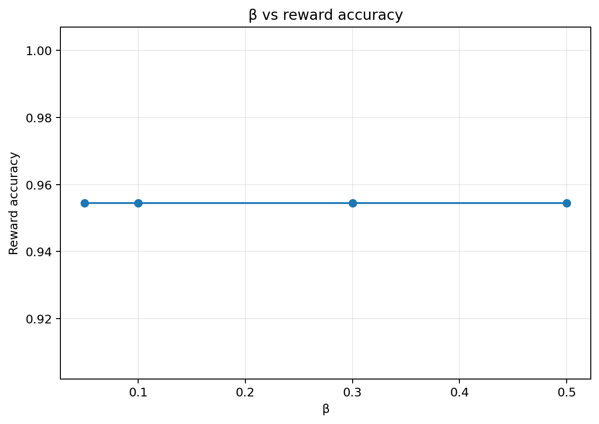

The curve is completely flat because all four configurations classify the same 42 of 44 preference pairs correctly.

### β vs evaluation margin

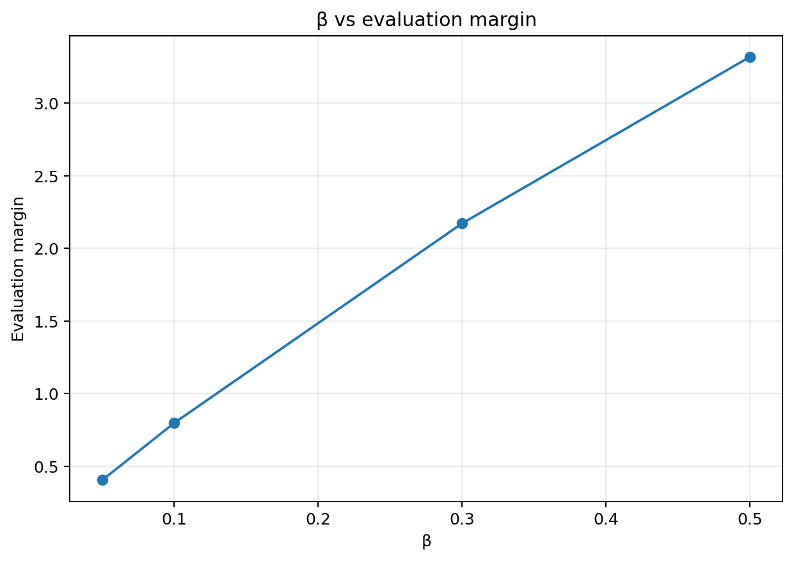

The margin increases strongly with β, from 0.4048 at β=0.05 to 3.3196 at β=0.50.

This shows that β materially changes the strength of preference separation even though pairwise accuracy remains unchanged.

### β vs evaluation loss

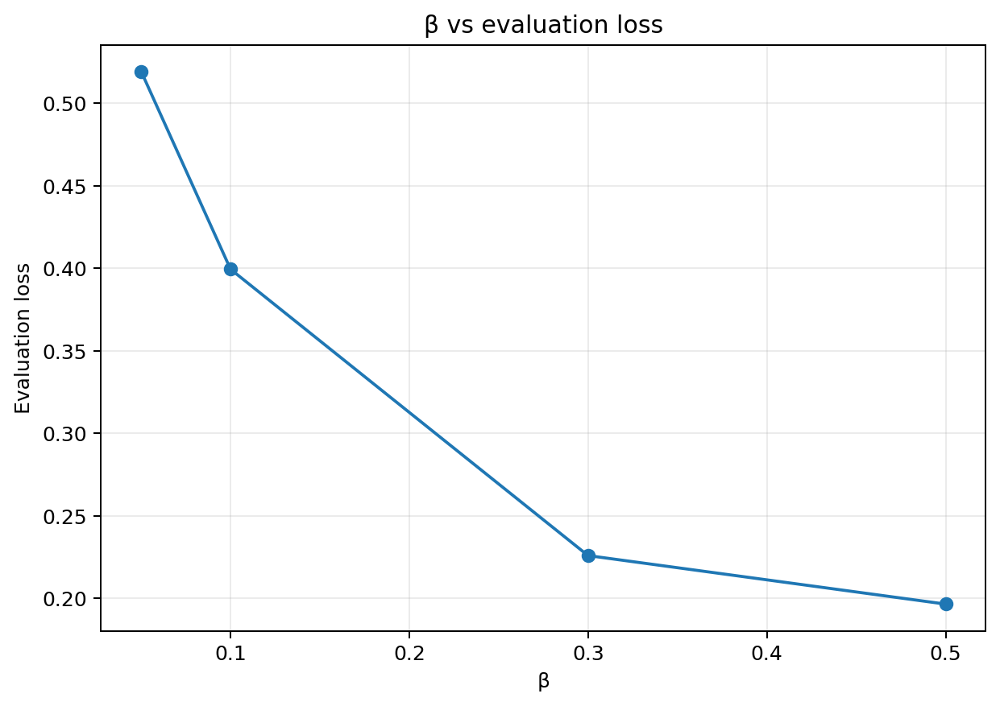

Evaluation loss decreases as β increases. This is an observed optimization behavior, not evidence that β=0.50 produces the best generations.

### Combined final β sweep

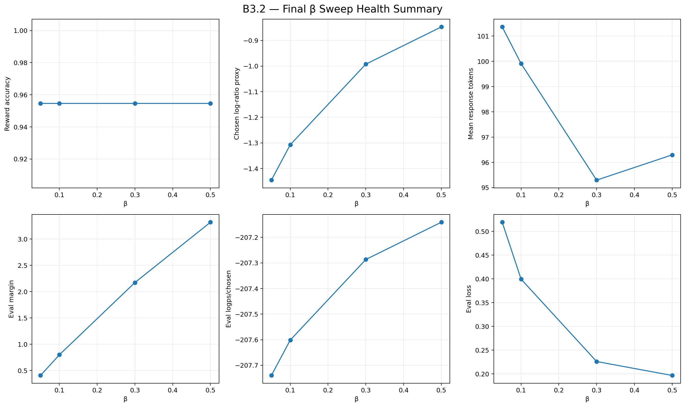

---

# 2. Reference-relative log-probability movement

The DPO reward satisfies:

$$
r_\beta(y,x)
=
\beta
\left[
\log\pi_\theta(y\mid x)
-
\log\pi_{\mathrm{ref}}(y\mid x)
\right]
$$

Therefore:

$$
\frac{r_\beta(y,x)}{\beta}
=
\log\pi_\theta(y\mid x)
-
\log\pi_{\mathrm{ref}}(y\mid x)
$$

The resulting values are treated as a **sequence-level reference-relative log-ratio proxy**, rather than an exact KL divergence.

|    β | Chosen Δlogp | Rejected Δlogp | Chosen policy logp |
| ---: | -----------: | -------------: | -----------------: |
| 0.05 |      -1.4456 |        -9.5416 |           -207.740 |
| 0.10 |      -1.3073 |        -9.2904 |           -207.601 |
| 0.30 |      -0.9927 |        -8.2353 |           -207.287 |
| 0.50 |      -0.8470 |        -7.4862 |           -207.141 |

The corresponding visualization is:

### β vs reference-relative log-ratio proxy

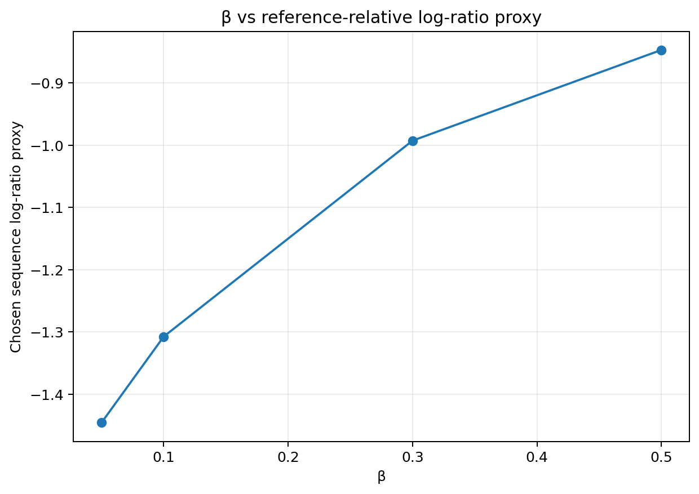

As β increases, the magnitude of the chosen and rejected sequence-level reference-relative log-ratios decreases, while the chosen-versus-rejected reward margin increases substantially.

This indicates stronger relative preference separation without demonstrating that the overall policy has improved.

### β vs `logps/chosen`

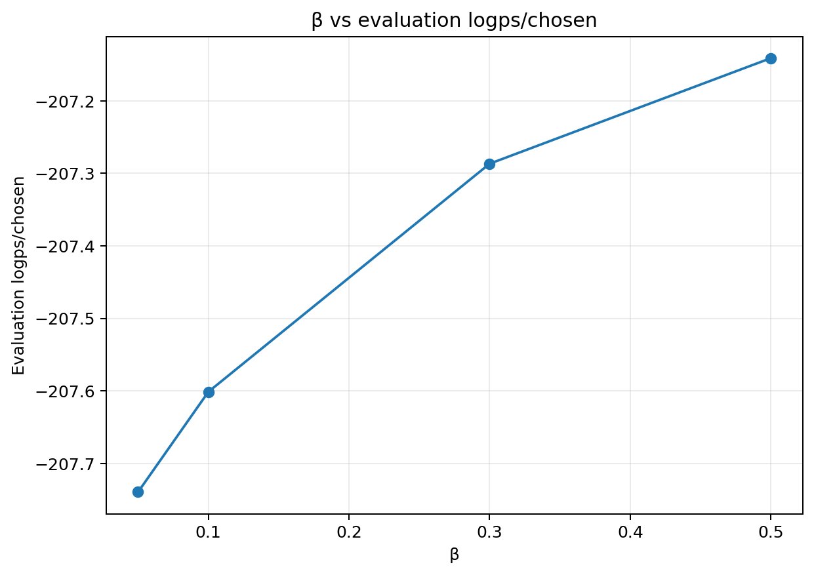

The chosen policy log-probability changes from approximately -207.74 at β=0.05 to -207.14 at β=0.50.

There is therefore **no observed collapse of `logps/chosen`** across this β sweep.

The absolute sequence log-probability should nevertheless be interpreted cautiously because it depends on the number of scored response tokens.

---

# 3. Generation length

Generation was evaluated on the same 44 fixed prompts for the SFT baseline and all four DPO checkpoints.

| Condition | Mean tokens | Min | Max | Max-length hits |
| --------- | ----------: | --: | --: | --------------: |
| SFT       |        76.5 |  16 | 244 |            0/44 |
| β=0.05    |       101.4 |  16 | 256 |            2/44 |
| β=0.10    |        99.9 |  16 | 256 |            0/44 |
| β=0.30    |        95.3 |  16 | 256 |            1/44 |
| β=0.50    |        96.3 |  16 | 233 |            0/44 |

### β vs mean response length

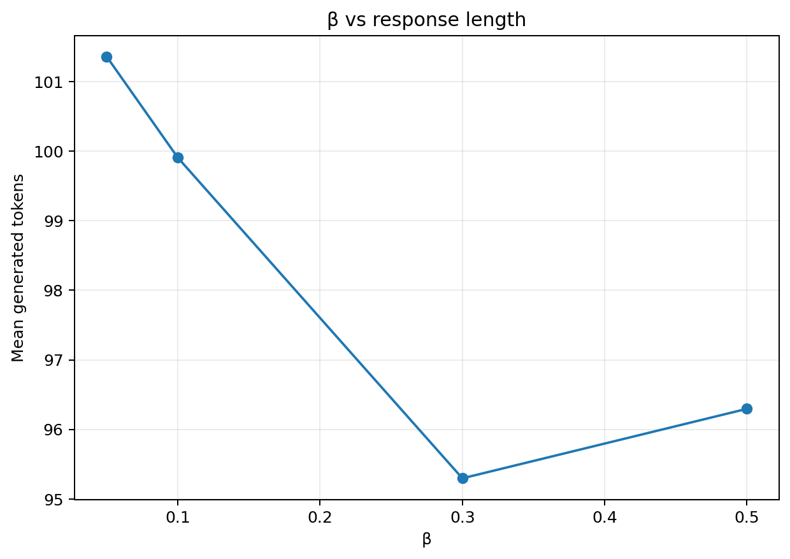

DPO increased average response length relative to the SFT baseline.

The β=0.05 configuration produced the longest average responses and had two generations reach the 256-token generation cap.

β=0.30 had one generation reaching the cap, while β=0.10 and β=0.50 had no max-length hits despite β=0.10 having a maximum generated length of 256 according to the reported summary. The max-length-hit count is therefore the primary truncation indicator used here.

Length differences alone are not interpreted as quality differences.

---

# 4. Training-step health curves

Final evaluation values can hide transient behavior during training. Evaluation was performed at steps 10, 20, 30, 40, and 50, allowing the evolution of the main health metrics to be inspected.

### Margin over training

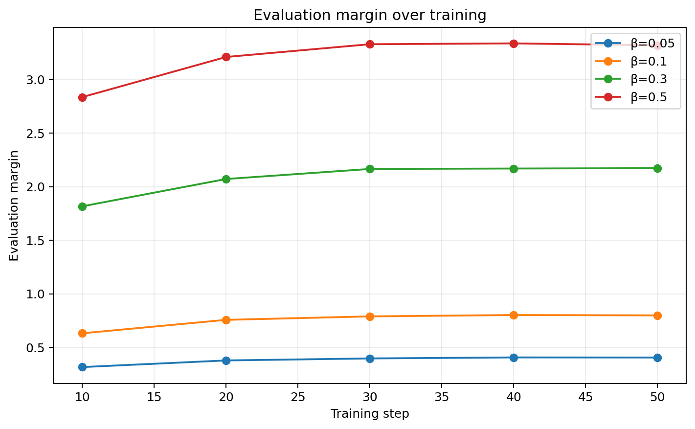

The reward margin increases during training for all β values, with larger β producing substantially larger margins.

### Chosen reward over training

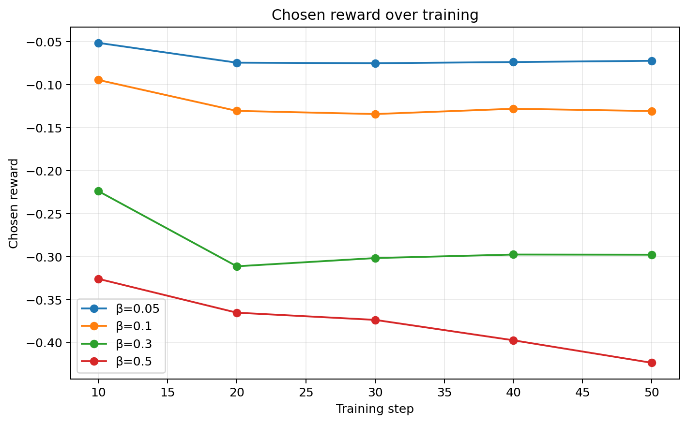

The chosen reward becomes increasingly negative as β increases. This is not interpreted independently from the rejected reward and resulting margin.

### Reference-relative log-ratio proxy over training

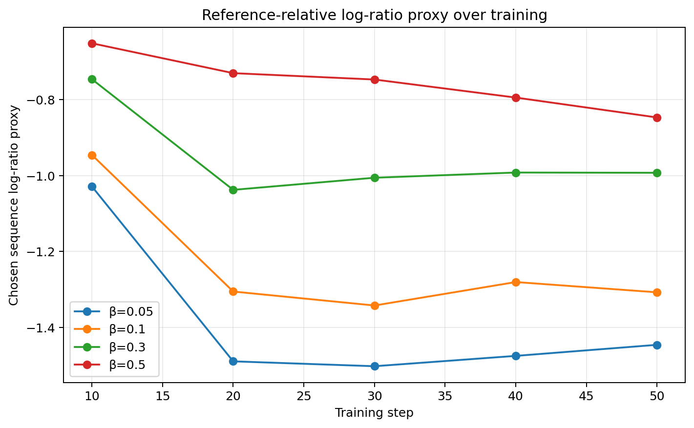

The sequence-level reference-relative log-ratio proxy provides a view of how the policy moves relative to the reference throughout training.

This remains a proxy rather than an exact KL measurement.

### `logps/chosen` over training

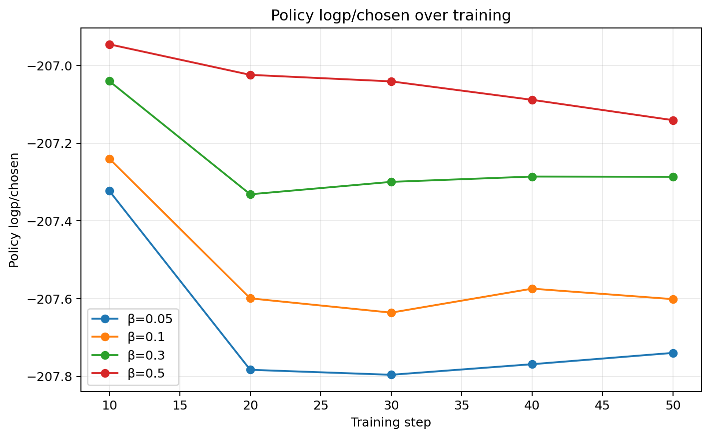

The chosen sequence log-probabilities remain relatively stable across the short 50-step training runs and do not show an obvious collapse.

### Combined training health summary

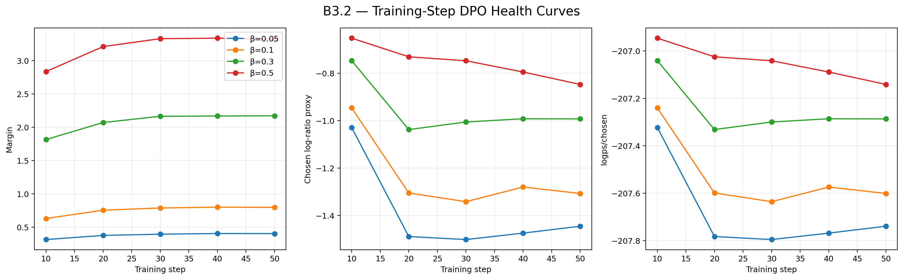

The training curves confirm that β changes the magnitude of preference optimization during the run rather than simply producing different final losses.

---

# 5. Qualitative generation diagnostic

A fixed set of 10 prompts was inspected across the SFT baseline and all four DPO checkpoints.

The prompts covered:

* Algerian cultural practices
* Algerian food
* machine learning
* computer troubleshooting
* browser behavior
* household safety
* productivity
* consumer advice

The qualitative inspection found substantial pre-existing generation failures in the SFT baseline, including irrelevant or semantically incorrect answers.

DPO did not eliminate these failures.

The qualitative analysis therefore serves as a diagnostic of whether the numerical preference metrics correspond to observable generation improvements.

### β=0.05

A clear repetition failure occurred on the food prompt. The model repeatedly generated nutritional terms until reaching the 256-token generation limit.

This is consistent with the two max-length hits observed in the full 44-prompt generation evaluation.

The β=0.05 configuration is therefore retained as an experimental comparison point but flagged for generation-health concerns.

### β=0.10 and β=0.30

Several generations remained highly similar to the SFT behavior and retained existing semantic failures.

On the food prompt, the model hallucinated ingredients such as broccoli despite the prompt specifying only potatoes and eggs.

These examples indicate that the increased preference margin did not translate into reliable semantic improvement.

### β=0.50

The β=0.50 configuration had controlled generation length in this evaluation: its longest response was 233 tokens and no generation reached the 256-token cap.

However, qualitative inspection still revealed substantial semantic and safety-related failures.

For example, the gas-leak prompt produced unsafe instructions involving entering the house and searching for the gas source.

Therefore, controlled response length does not imply improved response correctness or safety.

### Overall qualitative finding

Across the inspected prompts, there was no systematic qualitative improvement that could be attributed to increasing β.

The DPO sweep therefore demonstrates stronger preference separation numerically, but does not establish a corresponding improvement in general generation quality.

---

# 6. Interpretation

The β sweep demonstrates that β materially changes DPO optimization behavior.

### 1. Preference separation increases with β

The final reward margin increases from:

$$
0.4048 \rightarrow 3.3196
$$

as β increases from 0.05 to 0.50.

Thus, β clearly affects the strength of the learned preference separation.

### 2. Pairwise preference accuracy remains unchanged

All four configurations achieve:

$$
42/44 = 95.45\%
$$

on the held-out preference set.

Therefore, the larger margins do not correspond to additional correctly classified preference pairs on this evaluation set.

### 3. The reference-relative movement changes systematically

The sequence-level reference-relative log-ratio proxy changes with β for both chosen and rejected responses.

The chosen proxy moves from -1.4456 to -0.8470, while the rejected proxy moves from -9.5416 to -7.4862.

These values should be interpreted as relative movement under the DPO reward formulation, not as exact KL divergence.

### 4. DPO changes generation length

Mean generated length increases from 76.5 tokens for SFT to between 95.3 and 101.4 tokens for the DPO configurations.

The largest increase occurs at β=0.05, which also produces two max-length hits.

### 5. `logps/chosen` does not show collapse

The final chosen sequence log-probability changes only modestly:

$$
-207.740
\rightarrow
-207.141
$$

from β=0.05 to β=0.50.

There is therefore no evidence from this metric alone of a catastrophic degradation of chosen-response probability.

### 6. Qualitative generation quality does not improve consistently

The qualitative inspection shows that substantial semantic failures remain across the DPO configurations.

Increasing β does not systematically resolve the existing SFT failures.

Some additional artifacts, particularly repetition at β=0.05, also appear.

### 7. β should not be selected using DPO loss alone

Although evaluation loss decreases monotonically across the tested β values, the loss is part of a β-scaled objective and therefore should not be treated as a direct cross-β quality ranking.

The selection decision must instead consider preference behavior, reference-relative movement, generation health, and downstream task quality.

---

# 7. B3.2 conclusion

The sweep provides evidence that β controls the strength of preference separation in this DPO setup.

However, the experiment does **not** establish that the largest β produces the best overall model behavior.

The observed results can be summarized as follows:

| Property                           | Observation                                        |
| ---------------------------------- | -------------------------------------------------- |
| Held-out preference accuracy       | 95.45% for all β                                   |
| Preference margin                  | Strongly increases with β                          |
| DPO evaluation loss                | Decreases with β, but not used for model selection |
| Reference-relative log-ratio proxy | Changes systematically with β                      |
| `logps/chosen`                     | No observed collapse                               |
| Response length                    | Higher for DPO than SFT                            |
| β=0.05 generation health           | Repetition and two max-length hits                 |
| Qualitative quality                | No systematic improvement across β                 |
| Existing SFT failures              | Persist after DPO                                  |

Based on the current evidence, **β=0.05 is flagged for generation-health concerns**, while β=0.10, β=0.30, and β=0.50 remain candidates for downstream evaluation.

No final β is selected at B3.2.

The final selection should be deferred until the candidate configurations are evaluated using the downstream Darija quality and preference-alignment evaluation planned for Track B.

---

# 8. Validation checklist

* [x] All β configurations versioned
* [x] Same training configuration across β values
* [x] Preference accuracy logged
* [x] Chosen and rejected rewards logged
* [x] Reward margin logged
* [x] Reference-relative sequence log-ratio proxy reported
* [x] `logps/chosen` reported
* [x] Generated response length reported
* [x] Maximum generated length checked
* [x] Max-length/truncation behavior checked
* [x] SFT baseline included
* [x] Fixed generation prompts used across all conditions
* [x] Qualitative generation comparison performed
* [x] Final β-comparison plots generated
* [x] Training-step health curves generated
* [x] Machine-readable B3.2 summary generated
* [x] Candidate β values identified
* [x] Final β selection deferred until downstream evaluation

## B3.2 status

**COMPLETE**

Candidate configurations for downstream evaluation:

```text
β ∈ {0.10, 0.30, 0.50}
```

β=0.05 is retained as a comparison point but flagged for generation-health concerns.
